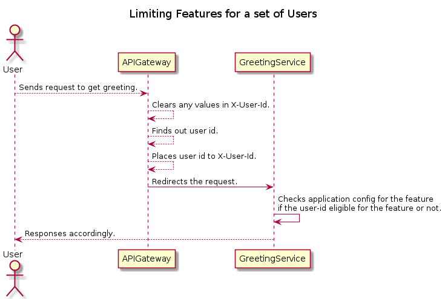
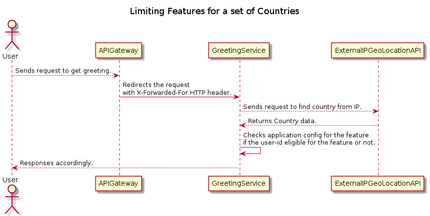

# Table of Contents

1.  [Distributed Configuration Management Design](#title)
2.  [Abstract](#abstract)
3.  [Glossary](#org114ea4e)
4.  [Background](#background)
    1.  [The Existing System Tech Stack](#orgff328b8)
5.  [Requirements](#requirements)
6.  [Method](#method)
    1.  [Options](#org349b957)
        1.  [1-Leveraging Consul](#orge70e963)
        2.  [2-Spring Cloud Config Server](#orgf2633b3)
        3.  [3-Custom Built Solution](#orgc938dc7)
        4.  [Conclusion](#org6b0ae77)
    2.  [Rolling out New Features by Feature Toggle](#orgb81c0de)
    3.  [Experimenting with Alternative Flows](#org5b73b50)
    4.  [Limiting Features for a set of Users](#limiting-features-for-a-set-of-users)
    5.  [Limiting Features for a set of Countries](#orgb536ebd)
    6.  [Shutting down a Feature](#orgdaa948f)
    7.  [Putting a Service in Read-Only Mode](#org3f38450)
7.  [Acknowledgements](#org6b9d740)

# Distributed Configuration Management Design

# Abstract

This document outlines the requirements for runtime configuration management in TheCompany* and proposes a solution by comparing alternatives.

# Glossary

-   **Feature Flag ([Release Toggles](https://martinfowler.com/articles/feature-toggles.html))**: Feature flags allow incomplete and un-tested code paths to be shipped to production as latent code which may never be turned on.

# Background

Due to business, development and operational reasons, it is valuable and desired to change some behaviours of the system promptly.
The longevity and dynamic nature of the changes can vary, such as enabling a new feature for all the user could be less dynamic than limiting a feature only for beta users or users who reaches the service from a set of contries.

## The Existing System Tech Stack

-   API Gateway on AWS public cloud.
-   Microservices which are built **mainly** in Java or Kotlin, and most of them leverage Spring Boot framework.
-   AWS RDS and Redis for data storage.
-   AWS proprietary queues systems (SQS, Kinesis).

# Requirements

-   The system **MUST** support changing runtime behaviour of applications timely manner (~2 seconds) for the followings:
    -   Rolling out new features.
    -   Experimenting with alternative flows.
    -   Limiting a feature for a set of users or set of countries.
    -   Shutting down a feature.
    -   Putting a service in read-only mode.

# Method

To address the requirements, this section will go through different cases and explain the general solution and some recommendations for each requirement.

## Options

### 1-Leveraging Consul

Consul is a distributed, highly available system which is a service mesh solution providing a full featured control plane with service discovery, configuration, and segmentation functionality.
Considering previous definition, Consul is one of the options which one might consider as a solution is to use [Consul](https://cloud.spring.io/spring-cloud-static/spring-cloud-consul/2.2.0.M3/reference/html/#spring-cloud-consul-config) for configuration management.

1.  Pros

    -   Consul has built-in [key-value](https://www.consul.io/docs/dynamic-app-config/kv)(KV) store.
    -   Consul has [HTTP API](https://www.consul.io/api-docs/kv#read-key) which enables CRUD operations.
    -   Consul has a feature called [Watches](https://www.consul.io/docs/dynamic-app-config/watches#watches) which provides updating key-value(KV) information via enabling blocking HTTP calls to its API.
    -   Consul is supported by Spring Cloud with [Spring Cloud Consul](https://cloud.spring.io/spring-cloud-consul/reference/html/#spring-cloud-consul-config).
    -   It is possible to extend new features by introducing a custom library on top of [ConsulClient](https://www.javadoc.io/doc/com.ecwid.consul/consul-api/1.2.5/com/ecwid/consul/v1/ConsulClient.html).
    -   Spring Cloud Consul supports configurations which are a service [specific and common configs](https://cloud.spring.io/spring-cloud-consul/reference/html/#spring-cloud-consul-config).
    -   Consul has [Consensus protocol](https://www.consul.io/docs/architecture/consensus#consensus-protocol) which provides consistency.
    -   Consul has option to be backed by [Vault](https://learn.hashicorp.com/tutorials/vault/ha-with-consul) for secure and scalable storage.
    -   Consul is open-source and free software.

2.  Cons

    -   In general, [data is not replicated between different Consul datacenters](https://www.consul.io/docs/troubleshoot/faq#q-what-data-is-replicated-between-consul-datacenters). When a request is made for a resource in another datacenter,
    
    the local Consul servers forward an RPC request to the remote Consul servers for that resource and return the results
    
    -   Consul would require learning curve for installation, operational and maintenance.
    
    Note: In case you want to experiment with **dev** mode, be aware that Consul does not persist KVs in **dev** mode. 

### 2-Spring Cloud Config Server

Considering Spring Boot is the main framework, employing [Spring Cloud Config Server](https://cloud.spring.io/spring-cloud-config/reference/html/#_spring_cloud_config_server) and [Spring Cloud Config Client](https://cloud.spring.io/spring-cloud-config/reference/html/#_spring_cloud_config_client) could be a strong option.
[Spring Cloud Config](https://cloud.spring.io/spring-cloud-config/reference/html/#_environment_repository) allows different backend system integration for the storage of configs, such as Git, Vault and a database.
Choosing a dedicated Git repository only for configs  as the backend/storage of Config Server looks promising, it provides auditing, runtime support by enabling changing via git PRs and notifying Config Server thanks to [Git (web)hooks](https://git-scm.com/book/en/v2/Customizing-Git-Git-Hooks).
Configs are read by Config Clients during start up, but keeping track of changing configs is a different challenge. If the system only leverages Spring Cloud Config Server and Client, then 
to reflect config changes in the Config Server to the clients, there is a need of calling **/actuator/refresh** endpoints of the clients when there is a change. 
When this endpoint is triggered, every bean marked with an [@RefreshScope](https://www.javadoc.io/doc/org.springframework.cloud/spring-cloud-commons-parent/1.1.4.RELEASE/org/springframework/cloud/context/scope/refresh/RefreshScope.html) is refreshed and the new configs become available in the client applications. 
Calling each client application manually would easily become a blocker in a system with many microservice. To ease the config change communication overhead, [Spring Cloud Bus](https://cloud.spring.io/spring-cloud-bus/reference/html/) is employed in the industry.
Spring Cloud Bus links nodes of a distributed system with a lightweight message broker. This can then be used to broadcast state changes (e.g. configuration changes) 
or other management instructions. AMQP and Kafka broker implementations are included with the project. 

1.  Pros

    -   This option leverages Spring Boot and Spring Cloud, and does not require a new domain expertise.
    -   Supports environment specific configuration out of box.
    -   Config changes are version controlled and reviewed by Git PR process
    -   Scaling Spring Config Servers is easy by introducing multiple instances using the same git repo as the source of configs.
    -   Allows runtime config changes without redeploying or re-starting services, just by merging a Git PR.

2.  Cons

    -   Multiple abstractions and framework usages:
        -   There might be cases debugging/solving problems take time.
        -   Some future custom requirements might be harder to cover, such as keep track of creation time of some configs.
    -   Spring Cloud Bus will require an event bus introduced to the system, AWS SQS or Kinesis is not supported.

### 3-Custom Built Solution

The existing requirements can also be covered by introducing a new service written in-house. The new service can have an API for CRUD
operations on configs in the system. The custom solution would need to re-invent some of the features come with usage of Spring libraries or Consul.
Re-inventing the features would be unnecessary considering the current requirements can be covered by other options which employ libraries and tools without high engineering cost.

### Conclusion

As conclusion, leveraging Spring Cloud and Spring Cloud Bus looks like the reasonable solution, considering many documentation and articles about these libraries,
and my experience during the implementation should be smooth.

## Rolling out New Features by Feature Toggle

This requirement is covered by creating a PR to config Git repository.

## Experimenting with Alternative Flows

This requirement can be covered by feature flags on backend side. One feature flag can be used by many services or a single service to determine the chosen flow.

## Limiting Features for a set of Users

To be able to limit a feature for a set of users, the system must have a way to identify the user who owns the request, and secondly if the user is allowed for the a feature or not.
The services of TheCompany* are reached by API Gateway, assuming there is an authentication mechanism in the system such as JWT token, API gateway can identify users with their unique identifier in the system.
API Gateway can forward requests to the related service only after placing unique identifier to *X-User-Id* HTTP header. API Gateway must delete any previous values in  *X-User-Id* HTTP header values in the request to prevent vulnerability.
As the last destination for the HTTP request, the destination service is able to decide whether the user who sends the request is eligible for the feature or not by using **user id** in *X-User-Id* HTTP header and
checking application configuration (which is managed by Spring Cloud Config) for the user.

## Limiting Features for a set of Countries

For this requirement, there are 2 possible interpretations. 

1.  The feature is only eligible for users who are from a set of countries.
    -   If this was the requirement, the solution is pretty similar to the flow described in [6.4](#limiting-features-for-a-set-of-users) with only change of finding the user's country from its user id,
    -   Assuming that the system keeps record of country of the users.
2.  The second case could be to limit the requests for the countries which an HTTP request comes from regardless of the origin country of the user.
    -   Assuming AWS is configured to include IP information to HTTP requests by adding [X-Forwarded-For](https://docs.aws.amazon.com/elasticloadbalancing/latest/classic/x-forwarded-headers.html%20%20%20%20) HTTP header, the origin country of the request could be found from the IP address information.
    -   The system later can identify origin country of the request by using an [IP geo location API](https://www.abstractapi.com/api/ip-geolocation-api%20%20%20%20).

## Shutting down a Feature

Shutting down a feature can be achieved in the same way rolling out a new feature by changing application configs runtime by a Git PR to config repository.

## Putting a Service in Read-Only Mode

Changing the feature flag's value for the mode of a service to read-only or read-write without re-deploying or re-starting the service is possible by Spring Cloud Config and Spring Cloud Bus usage.
Assumption here is that the service which is desired to be put on read-only mode supports this mode depending on the application configuration.

# Acknowledgements

-   This document benefited from the following articles on <https://martinfowler.com/>: [FeatureToggles](https://martinfowler.com/bliki/FeatureToggle.html%20%20%20%20) and [Feature Toggles (aka Feature Flags)](https://martinfowler.com/articles/feature-toggles.html%20%20%20%20).
-   [Distributed Systems Configuration Management Using Apache Zookeeper](https://medium.com/onebyte-llc/distributed-systems-configuration-management-using-apache-zookeeper-2121b231a4a4%20%20%20%20)
-   [Automating Dynamic Config Management with Spring Cloud Config Bus](https://medium.com/trendyol-tech/automating-dynamic-config-management-with-spring-cloud-config-bus-a34e15397b15%20%20%20%20)
-   [Quick Intro to Spring Cloud Configuration](https://www.baeldung.com/spring-cloud-configuration%20%20%20%20)
-   [A Quick Guide to Spring Cloud Consul](https://www.baeldung.com/spring-cloud-consul%20%20%20%20)

